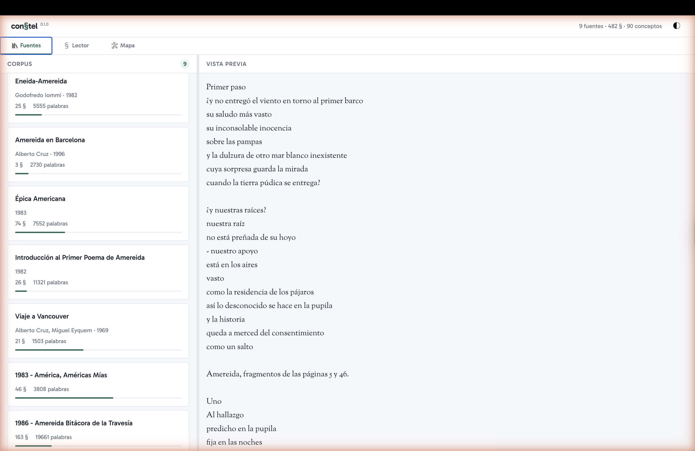
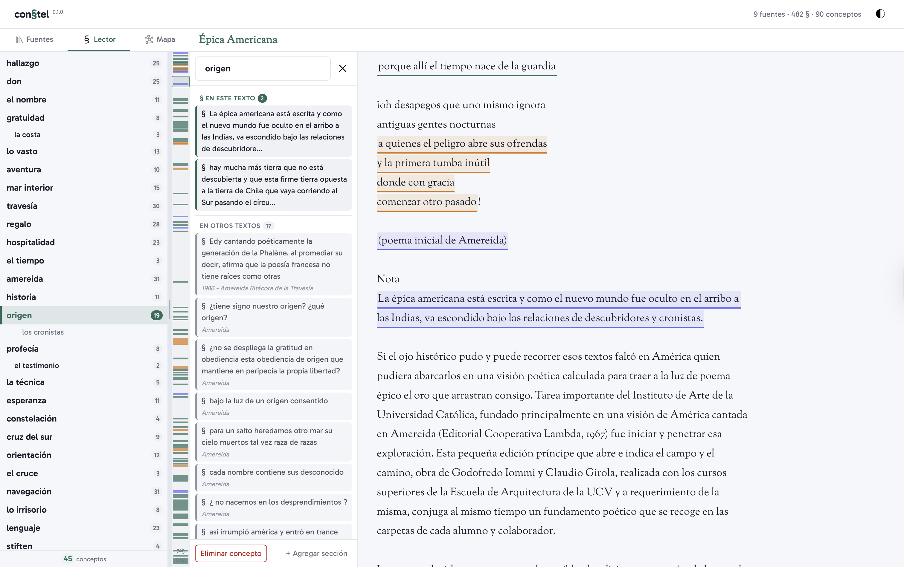
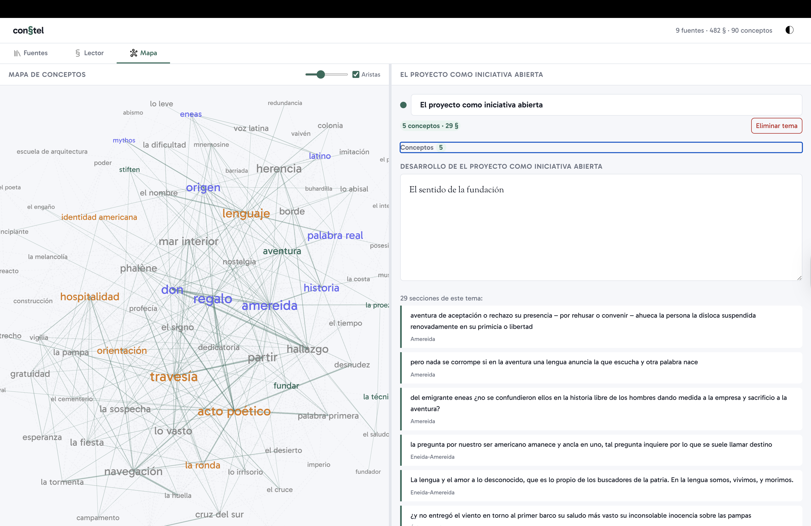

# con§tel

Herramienta de análisis temático de corpus textuales. Sirve tanto para el estudio de textos filosóficos como para el análisis de entrevistas de investigación.

**[Demo en vivo →](https://herbertspencer.net/constel/)**

## Modelo conceptual

con§tel formaliza el acto de lectura activa en 5 entidades:

| Entidad | Símbolo | Descripción |
|---------|---------|-------------|
| **source** | — | Texto fuente (entrevista, texto filosófico, etc.) |
| **excerpt** | § | Pasaje seleccionado dentro de un source |
| **concept** | [a] | Etiqueta o ancla asignada a un excerpt |
| **theme** | — | Agrupación de concepts afines (metacategoría) |
| **note** | {n} | Texto emergente del investigador/lector |

```
source  ──1:N──▸  excerpt
excerpt ◂──N:M──▸ concept    (un excerpt puede tener varios concepts y viceversa)
concept ──N:1──▸  theme      (cada concept pertenece a 1 theme, o ninguno)
theme   ──1:N──▸  note       (un theme puede tener múltiples notas)
```

La relación central `excerpt ◂──▸ concept` es muchos-a-muchos. Los concepts se agrupan en themes, y las notes son la destilación — el texto propio que emerge del análisis.

## Las 3 pestañas

### 1. Fuentes — el corpus



Lista los textos del corpus con sus metadatos. Incluye un **buscador full-text** que busca dentro de todos los textos del corpus y navega al resultado.

- **Importar**: click en una tarjeta carga el texto desde `corpus/`
- **Editar metadatos**: botón abre un modal con título, autor, fecha, participante, rol, notas
- **Frontmatter YAML** opcional en cada `.txt` para metadatos automáticos

### 2. Lector — codificación in vivo



Tres paneles: glosa cronológica | minimap | texto. El botón de ojo (junto al título del documento) permite ocultar/mostrar las marcas de excerpts para una lectura limpia.

**Glosa cronológica** (izquierda): lista vertical de todos los conceptos presentes en el texto, ordenados por primera aparición. Los conceptos que aparecen en múltiples pasajes son más prominentes. El ancho se ajusta con el resizer draggable.

**Minimap** (centro): barra vertical proporcional al largo del texto. Las bandas marcan la posición de cada excerpt.

**Texto** (derecha): el texto completo con los excerpts subrayados. El flujo de trabajo:

1. **Seleccionar** un pasaje con el mouse
2. Aparece un **popup con input** y autocomplete del vocabulario existente
3. **Escribir o elegir** un concepto → se crea el excerpt vinculado
4. Click en un concepto de la glosa abre el **panel de detalle** con todas sus secciones, separadas en "§ en este texto" y "en otros textos"
5. Desde el detalle se puede **renombrar**, **eliminar** el concepto, o **agregar más secciones**

### 3. Mapa — síntesis temática



Dos paneles: grafo de conceptos | gestión de temas.

**Grafo force-directed** con switch **2D/3D**: todos los conceptos del corpus como etiquetas de texto. Su tamaño tipográfico refleja la frecuencia (cantidad de excerpts × cantidad de fuentes). Sin negrita, solo varía el tamaño (11px–31px).

#### Topología del mapa

Los conceptos se conectan por **co-excerpt**: dos conceptos se vinculan si y solo si el investigador los etiquetó en el mismo pasaje. Esto refleja decisiones explícitas del lector, no accidentes del texto.

El peso del link = cantidad de excerpts compartidos. Más co-ocurrencias → más cerca en el mapa.

Los conceptos agrupados en un mismo **tema** se atraen hacia su centroide y se conectan con líneas punteadas del color del tema.

**Controles**:
- **Switch 2D/3D**: alterna entre visualización SVG plana y grafo WebGL tridimensional
- **Umbral ≥ N**: filtra links por mínimo de secciones compartidas — permite podar y revelar la estructura fuerte
- **Fuerza**: regula la atracción entre nodos conectados (suelto ↔ apretado)
- **Toggle aristas**: mostrar/ocultar las líneas (incluye las de centroide temático)
- **Zoom y paneo**: rueda del mouse + arrastrar (en 3D: orbitar con drag, pan con Espacio + drag)

**Panel de temas** (derecha): espacio de síntesis del investigador.

- **Crear tema**: nombrar una agrupación → seleccionar conceptos
- **Editar tema**: renombrar inline, agregar/quitar conceptos
- **Nota de desarrollo**: textarea libre para la síntesis
- **Secciones del tema**: lista de todos los excerpts agrupados con la cita, el concepto y la fuente

## Arquitectura de persistencia

con§tel usa un modelo de **persistencia dual** que permite funcionar tanto como aplicación web estática (GitHub Pages) como con servidor local:

```
┌─────────────────┐         ┌──────────────────┐
│   localStorage   │◀──────▸│   constel-db.json │
│   (inmediato)    │  sync   │   (servidor)      │
└─────────────────┘         └──────────────────┘
        ▲                           ▲
        │                           │
   siempre escribe           solo si hay servidor
   siempre lee primero       reconcilia por updatedAt
```

### Modo local (con servidor)

```bash
git clone https://github.com/hspencer/constel.git
cd constel
node server.mjs
```

Abre [http://127.0.0.1:8787](http://127.0.0.1:8787). Todos los cambios se guardan en `localStorage` inmediatamente y se sincronizan al archivo `constel-db.json` en disco (debounced 300ms). Al cargar, el sistema reconcilia: gana el más reciente entre localStorage y disco.

### Modo demo (GitHub Pages, sin servidor)

La app detecta automáticamente la ausencia de servidor. Los textos se cargan desde los archivos estáticos del repositorio. Los cambios del usuario se guardan en `localStorage` — persisten entre sesiones del mismo browser.

Para **compartir tu trabajo** o **llevártelo**: usa **Exportar** (descarga un ZIP con todos los textos + la base de datos con tus anotaciones). Cualquiera puede **Importar** ese ZIP en su instancia.

### Filosofía: BBDD como texto

Todo el estado vive en un único archivo JSON legible, versionable con git, trivial de copiar. Los textos fuente viven como `.txt` en `corpus/` y no se duplican. No hay base de datos relacional, no hay migraciones, no hay build step.

## Stack técnico

- Vanilla JavaScript (ES6 modules), HTML5, CSS3
- Node.js con HTTP nativo (sin frameworks, sin npm dependencies)
- D3.js para el grafo 2D de conceptos
- Three.js + 3d-force-graph para el grafo 3D
- JSZip para export/import
- Google Fonts: Gabarito (UI) + Sorts Mill Goudy (lectura)
- Persistencia: localStorage + JSON file

## Estructura de carpetas

```
constel/
├── corpus/              ← textos van aquí (.txt o .md)
├── data/
│   └── constel-db.json  ← la base de datos
├── public/              ← la aplicación web
│   ├── css/             ← estilos por componente
│   ├── js/              ← módulos ES6
│   └── icons/           ← íconos SVG
├── scripts/             ← herramientas de automatización
└── server.mjs           ← servidor Node.js
```

## Metadatos con frontmatter (opcional)

```markdown
---
title: Entrevista participante P-07
author: Equipo de investigación
date: 2026-03-15
participant: P-07
role: diseñador senior
notes: Segunda sesión, contexto laboral
---

El texto del documento comienza aquí...
```

## Origen

con§tel nace como proyecto de investigación en la e[ad] Escuela de Arquitectura y Diseño de la PUCV (2004-2006), preguntándose por la forma escolástica de leer, anotar y extender un corpus textual común en la pantalla digital. La hipótesis: la interacción produce un espacio semántico.

Esta versión generaliza la mecánica original para servir como herramienta de análisis temático (Braun & Clarke) aplicable a cualquier corpus textual.

## Licencia

MIT
